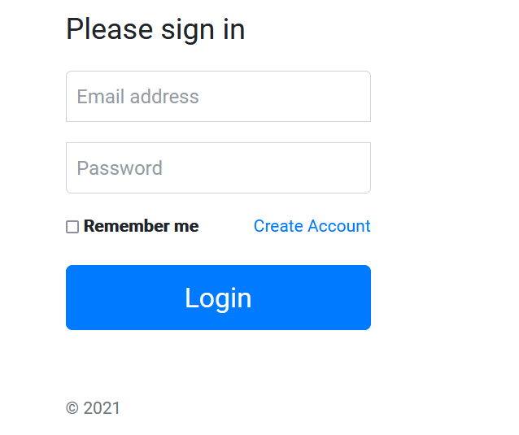
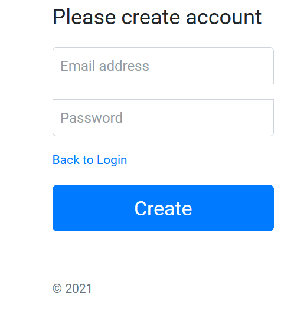
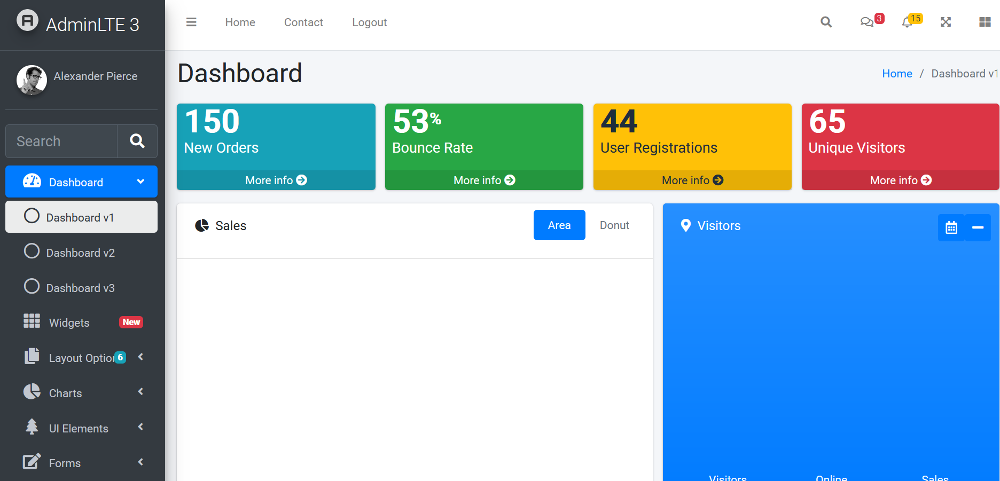

# Challenge Bten Frontend

## File Structure 

Here we demonstrate the structure of custom folders, the rest follows the project's own architecture. There was also a concern about not repeating code and making it readable to other programmers using best practices

```
project
│└──backend (nodejs/nestjs)   
│   │    auth
│   │    user
│   │      └─── schema
└───app (angular)
│   │     auth
│   │     interceptors
│   │     pages
│   │     services
```
## Run

For App Angular: 
```sh
cd folder
yarn
ng serve
```

For App Angular: 
```sh
cd backend/api-login
npm install
npm run start:dev
```

## Endpoints (backend)
- DEL - deleteAllUsers: localhost:3000/user
- DEL - deleteUser: localhost:3000/user/:id
- GET - getAllUsers: localhost:3000/user
- POST - createUser: localhost:3000/user
- POST - authLogin: localhost:3000/auth/login

data is being saved in mongodb

## What Was Done
- Login ✔️
- Register ✔️
- Dashboard ✔️
- Responsive Design ✔️

## Screens





